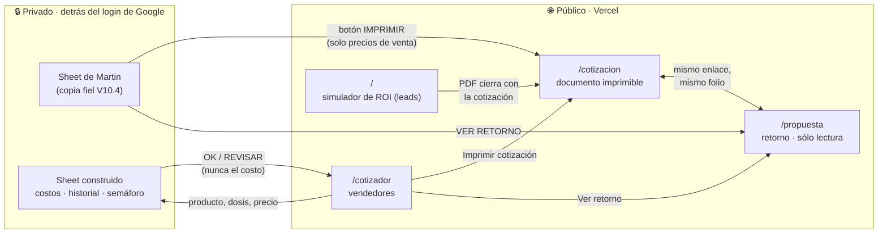

<div align="center">


# Cotizador y Simulador de ROI · Grupo Leucotec

**Automatización del proceso de cotizar campañas de vacunación corporativa.**<br/>
El producto final es la cotización: un documento ultradetallado que el cliente firma.

[Simulador](https://leucotec.ia.potenttial.site/) · [Cotizador para vendedores](https://leucotec.ia.potenttial.site/cotizador) · [Guía de venta](https://leucotec.ia.potenttial.site/guia)

<sub>Hecho por <b>N3 · Thinktech IA Laboratory</b></sub>

</div>

---

> [!WARNING]
> **Este repositorio es público.** Antes de escribir una sola línea, lee [Reglas de confidencialidad](#-reglas-de-confidencialidad). Los costos de compra de Leucotec jamás pueden llegar al código, al bundle, a un comentario ni a un mensaje de commit.

## Índice

- [Qué es esto](#-qué-es-esto)
- [Cómo encajan las piezas](#-cómo-encajan-las-piezas)
- [Arranque rápido](#-arranque-rápido)
- [Rutas](#-rutas)
- [Estructura del proyecto](#-estructura-del-proyecto)
- [El modelo de cálculo](#-el-modelo-de-cálculo)
- [Reglas de confidencialidad](#-reglas-de-confidencialidad)
- [Integración con Google Sheets](#-integración-con-google-sheets)
- [Formatos de enlace](#-formatos-de-enlace)
- [Despliegue](#-despliegue)
- [Antes de hacer push](#-antes-de-hacer-push)
- [Convenciones](#-convenciones)
- [Pendientes y deuda conocida](#-pendientes-y-deuda-conocida)

---

## 🎯 Qué es esto

Grupo Leucotec aplica campañas de vacunación dentro de empresas. Sus vendedores cotizan hoy con un Excel que armó Martin, el dueño, y que el equipo domina. Este proyecto automatiza ese proceso sin obligarlos a cambiar de herramienta.

El vendedor tiene **dos puertas**, y ambas terminan en **la misma cotización impresa**:

| Puerta | Para quién | Qué ofrece |
|---|---|---|
| **Sheet de Martin** (V10.4) | Vendedores que ya dominan el Excel | Su archivo de siempre, subido tal cual a Google Sheets, con un botón **IMPRIMIR COTIZACION** |
| **Cotizador en línea** (`/cotizador`) | Vendedores en visita, desde el celular | Mismo orden y colores que el Excel, semáforo de margen, historial y botón de imprimir |

Y dos herramientas **frente al cliente**:

| Herramienta | Qué hace |
|---|---|
| **Propuesta de retorno** (`/propuesta`) | El anexo de la cotización para un prospecto calificado. Recibe el mismo enlace (mismo folio, mismos renglones) y es de **sólo lectura**: su inversión es, al peso, el total de la cotización |
| **Simulador de ROI** (`/`) | Versión editable para una fase posterior de captación de leads. Traduce la vacunación de "gasto médico" a "continuidad operativa": cuánto pierde la empresa por ausentismo, cuánto cuesta protegerse al año y cuál es el ahorro neto |

---

## 🧭 Cómo encajan las piezas



La idea central: **una sola cotización, varias puertas.** Si cada puerta armara su propio documento, en un mes dejarían de coincidir. Cualquier renglón nuevo se agrega en un solo lugar (`CotizacionDetallada.tsx`) y aparece en todas.

---

## 🚀 Arranque rápido

**Requisitos:** Node 20 o superior.

```bash
npm install
npm run dev        # http://localhost:5173
```

```bash
npm run build      # typecheck + build de producción en ./dist
npm run preview    # sirve el build localmente
npm run lint
npm test           # motor de logística contra el Excel de Martin
```

Para probar la cotización impresa sin pasar por una hoja, abre `/cotizacion?c=…` con un enlace generado desde `/cotizador` (botón **Imprimir cotización**).

---

## 🗺️ Rutas

| Ruta | Componente | Registro previo | Audiencia |
|---|---|:---:|---|
| `/` | `Simulator` (vía `EntradaSimulador`) | ✅ nombre y correo | Prospectos y clientes |
| `/cotizador` | `Cotizador` | — | Vendedores de Leucotec |
| `/cotizacion?c=…` | `PaginaCotizacion` | — | Vendedores (lo imprimen para el cliente) |
| `/propuesta?c=…` | `PaginaPropuesta` | — | Prospecto calificado (anexo de la cotización) |
| `/guia` | `public/guia/index.html` | — | Guía de venta estática |
| `/n3` | `public/n3/index.html` | — | Diapositiva del mapa de herramientas |

El ruteo es deliberadamente mínimo: `App.tsx` lee `window.location.pathname`. No hay router; agrega uno sólo si las rutas crecen.

---

## 📁 Estructura del proyecto

```
src/
├── App.tsx                        Ruteo por pathname y entrada del simulador
├── lib/
│   ├── calculations.ts            ⚙️  Motor puro: ROI, amortización, logística multi-sede
│   ├── cotizacionImprimible.ts    📄 Modelo de la cotización + codificación del enlace
│   ├── propuestaRoi.ts            📈 Cotización → simulación de ROI que cuadra al peso
│   ├── cotizador.ts               📡 Envío al Sheet privado y lectura del semáforo
│   ├── enlaceCotizacion.ts        🔗 Enlace Sheet → simulador de ROI
│   ├── catalogoProductos.ts       💉 Productos y PRECIOS DE VENTA (nunca costos)
│   ├── insumosCatalogo.ts         🧤 Cantidades de insumos por dosis y manejo de RPBI
│   └── lead.ts                    📝 Registro de prospectos del simulador
├── hooks/
│   ├── useRoiCalculator.ts        Estado del simulador y catálogo de enfermedades
│   └── useCountUp.ts              Animación de cifras con salvavidas de pestaña en segundo plano
└── components/
    ├── Cotizador.tsx              /cotizador
    ├── PaginaCotizacion.tsx       /cotizacion
    ├── PaginaPropuesta.tsx        /propuesta (sólo lectura)
    ├── CotizacionDetallada.tsx    El documento. Un solo lugar para todos los renglones
    ├── SedesCampana.tsx           Captura de hasta 4 sedes (compartido)
    ├── ui/Field.tsx               Campo numérico que nunca emite NaN
    └── …                          Piezas del simulador (KPIs, gráfica, alertas)

apps-script/
├── cotizador-v10-4.gs             Script de la copia fiel del Excel de Martin
└── cotizador.gs                   Porción "Cotizar" del Sheet construido desde cero

public/
├── guia/  n3/                     Páginas estáticas
└── logo-leucotec.png
```

---

## 🧮 El modelo de cálculo

### Logística: réplica celda por celda del Excel de Martin

`calcularLogistica` en `src/lib/calculations.ts` reproduce su hoja. **Si cambias una constante, el margen deja de cuadrar con su Excel.**

| Concepto | Regla | Celda en su Excel |
|---|---|---|
| Enfermera por jornada | $600 local de 1 a 4 h · $800 local de más de 4 h · $801 foránea | `G30` |
| Total enfermeras | tarifa × enfermeras por día × jornadas | `J30` |
| Prueba COVID del equipo | $335, **una vez por sede**, no por jornada | `H38` |
| Viáticos | transporte + comidas + prueba COVID | `J38` |
| Insumos por dosis | $18.073, el **promedio** de sus tres escenarios de volumen. **Ya incluye botes y servicio de RPBI** | `L38` → `Insumos!B37` |
| Logística total | suma de las hasta 4 sedes | `N42` |

Detalles que ya costaron bugs:

- **Hasta 4 sedes que operan al mismo tiempo.** Cada una lleva su propio equipo: los días **no se suman** entre sedes.
- **Comirnaty en cajas de 10:** se puede capturar en dosis o en cajas (hoja: columna UNIDAD `I5:I12`; web: botón *Cajas de 10*). La caja multiplica dosis y costo por 10 y divide el precio, así que 2 cajas a $9,500 y 20 dosis a $950 dan el mismo importe, costo, insumos y semáforo. La cotización siempre sale en dosis.
- **Reparto de dosis:** la primera sede con dosis en 0 absorbe las que no se asignaron a las demás.
- **La logística es costo y se cobra dentro del precio por dosis** (confirmado por Martin, 14 sep 2026). No va como cargo aparte: el gran total del Excel (H17) suma sólo vacunas, y la logística entra al costo (F17) para que el semáforo verifique que el precio la cubre. En la cotización, los renglones de operación dicen **Incluido** y se aclara que no hay cargos adicionales.

### Caso de referencia (prueba de regresión)

Es el ejercicio que Martin capturó en su propio archivo. **Cualquier cambio al motor debe seguir dando esto:**

| Entrada | Resultado esperado |
|---|---|
| 30 dosis de Fluzactal Tetra a $405 · sede LOCAL de 1 a 4 h · 1 enfermera · 1 jornada · transporte $800 · comidas $0 | enfermeras **$600** · viáticos **$1,135** · insumos **$542.19** · logística **$2,277.19** · precio **$12,150** · semáforo **ok** |

### Simulador de ROI

Modelo determinista de valor esperado, defendible ante un CFO:

1. **Población en riesgo** = plantilla × % objetivo.
2. **Casos esperados** = población × tasa de contagio.
3. **Costo por caso** por dos vías: días de ausencia × costo del día, más atención médica.
4. **Inversión amortizada** a los años que protege cada vacuna. Es la práctica estándar de economía de la salud: Zóster protege ~10 años y cargarlo a un solo ejercicio lo castigaría injustamente.
5. **Efecto fiscal** (LISR art. 28 fr. XXX): la deducción reduce la **base**, no el impuesto → `inversión × 53% × 30%`.

Todo supuesto es un parámetro editable: el vendedor debe poder justificarlo.

---

## 🔐 Reglas de confidencialidad

Este repo es **público** y todo lo que llega al navegador se puede inspeccionar. Estas reglas no se negocian:

1. **Los costos de compra viven sólo en los Sheets privados.** Nunca en `src/`, en `apps-script/`, en un comentario, en un ejemplo ni en un mensaje de commit.
2. **Tampoco márgenes ni costos totales de ejemplo.** Con el margen y el precio, el costo de compra se despeja con una resta.
3. **El semáforo sólo regresa `OK` o `REVISAR`.** Nunca el costo ni el porcentaje de margen. Por la misma razón que el punto 2.
4. **Sólo viajan precios de venta** en los enlaces (`/cotizacion?c=`, enlace al ROI).
5. **Hojas de cálculo y documentos del cliente no entran al repo.** El `.gitignore` bloquea `*.xlsx`, `*.xls`, `*.xlsm`, `*.xlsb`, `*.docx`, `*.doc` y `*.pdf`. No lo aflojes.

Martin les oculta los costos a sus propios vendedores. Respetamos esa decisión en cada herramienta.

---

## 📊 Integración con Google Sheets

Hay dos hojas privadas, cada una con su Apps Script. **Pide acceso a Ricardo**: sus IDs y enlaces no se publican aquí.

### Copia fiel del Excel de Martin (V10.4)

Su archivo convertido a Sheets **sin reconstruir nada**. De la fila 1 a la 42 es intocable; lo nuestro vive debajo:

- **Filas 45–48:** datos del cliente.
- **Fila 50:** botón **IMPRIMIR COTIZACION** (`COTIZACIONURL`).
- **Fila 52:** enlace al simulador de ROI (`ENLACEROI`).
- **Menú** *Leucotec → Conectar con el simulador*: rearma ese bloque sin borrar lo capturado y aplica el candado.

Código fuente: [`apps-script/cotizador-v10-4.gs`](apps-script/cotizador-v10-4.gs).

### Sheet construido desde cero

Tiene las pestañas `Costos`, `Catalogo`, `Cotizaciones`, `Resumen` y `Config`, y el receptor `doPost` que usa `/cotizador` para el **semáforo** y el **historial**.

### Lo que hay que saber antes de tocar un Apps Script

| Tema | Detalle |
|---|---|
| **Idioma de la hoja** | Están en es-ES: las fórmulas separan argumentos con **punto y coma**. Con coma devuelven `#ERROR!` |
| **Funciones personalizadas** | Reciben como argumentos **todas** las celdas de las que dependen, aunque no las usen. Sin eso, Sheets no las recalcula y el vendedor imprime la cotización anterior |
| **Protección** | Bloqueo duro por identidad: sólo los correos de `EDITORES` tocan fórmulas, y los vendedores sólo las celdas verdes. Sheets no tiene contraseñas |
| **Hojas ocultas** | Ocultar **no es un candado**: cualquier editor las vuelve a mostrar. La protección impide escribir, no leer |
| **Despliegue** | Los scripts se pegan a mano en *Extensiones → Apps Script*. El `.gs` del repo es la fuente de verdad: mantenlos iguales |
| **Convención de color** | Verde fuerte = elegir de una lista · verde claro = escribir el valor · gris = se calcula solo. Viene del Excel de Martin y se respeta en `/cotizador` |

---

## 🔗 Formatos de enlace

### Cotización imprimible — `/cotizacion?c=<base64url>`

JSON codificado en base64 URL-safe. Se descartó un formato con separadores porque las descripciones del catálogo de Martin traen comas, dos puntos y acentos. Las llaves son cortas porque el enlace se arma dentro de una celda.

```jsonc
{
  "f": "COT-20260913-1203",           // folio
  "c": "Grupo Ejemplo",               // cliente
  "e": 120,                           // plantilla
  "l": [["Fluzactal Tetra", 30, 405]],// producto, dosis, precio de venta
  "s": [["CDMX", 30, 0, 0, 1, 1, 800, 0]],
  //      destino, dosis, foránea(1/0), jornada larga(1/0),
  //      enfermeras/día, jornadas, transporte, comidas
  "cl": 0,                            // cobrar logística (1/0)
  "d": 1300                           // costo de un día de ausencia (sólo lo usa /propuesta)
}
```

Modelo y codificación: `src/lib/cotizacionImprimible.ts`.

### Propuesta de retorno — `/propuesta?c=<base64url>`

**El mismo parámetro `c` que la cotización.** Para pasar de una a otra basta cambiar la ruta. `src/lib/propuestaRoi.ts` convierte la cotización en una simulación:

- Cada renglón se asigna a su enfermedad con `enfermedadDeProducto` (sin distinguir acentos: la hoja escribe "solo A" y el catálogo "sólo A"). Los renglones de la misma enfermedad se juntan.
- `% en riesgo = dosis / plantilla` y `precio = importe / dosis`, para que el motor reconstruya exactamente las dosis y el importe. La plantilla nunca es menor a la mayor cantidad de dosis.
- Un producto sin modelo de riesgo entra **sólo como inversión**, sin ahorro. Es la opción conservadora.
- La página compara `resultado.inversionTotal` contra el total de la cotización y avisa si no cuadran.
- Si `d` viene en 0 se usa la referencia de $1,300 y la página lo dice.

### Simulador de ROI — `/?…`

```
?empresa=Grupo+Ejemplo&emp=400&dia=1300
&v=Vaxigrip Tetra:400:440,Prevenar 20:400:1800
&log=0
&sedes=CDMX:400:local:mas4:2:3:1500:0|Toluca:120:foranea:mas4:1:2:3000:450
```

Los enlaces del formato anterior, con una sola sede (`dias`, `enf`, `via`, `sede`, `hrs`), se siguen leyendo. Lógica en `src/lib/enlaceCotizacion.ts`.

---

## ☁️ Despliegue

- **Vercel**, con despliegue automático en cada push a `main`.
- `vercel.json` reescribe `/guia` y `/n3` a sus páginas estáticas, y todo lo demás a `index.html` (SPA).
- Dominio: `leucotec.ia.potenttial.site`.

**Compatibilidad:** se usa **Tailwind v3 a propósito**, no v4. La v4 emite `oklch` y `@property`, que rompen en Chrome anterior a 111 y en Androids viejos, y los vendedores y clientes sí usan esos teléfonos. El `browserslist` es amplio por la misma razón.

---

## ✅ Antes de hacer push

```bash
npx tsc --noEmit -p tsconfig.app.json   # tipos
npm run build                           # build limpio
```

1. **Audita el bundle.** Busca en `dist/assets/*.js` los costos de la hoja `Costos` (tómalos de la hoja, no los escribas en ningún archivo). **Tiene que salir vacío.**
2. **Verifica el caso de referencia** en `/cotizador`: logística **$2,277.19** y precio **$12,150**.
3. **Prueba en celular** con el viewport móvil: no debe haber scroll horizontal.
4. **Si tocaste un Apps Script, pégalo** en su proyecto y actualiza el `.gs` del repo.

---

## ✍️ Convenciones

- **Español** en nombres de dominio, comentarios, textos de UI y mensajes de commit.
- **Los comentarios explican el porqué**, no el qué. Si una decisión costó un bug, déjalo escrito junto al código.
- **Commits** en español, en presente y describiendo el efecto: *"El total de la cotización ya no se sale de su recuadro"*.
- **Nada de NaN hacia el cálculo:** usa `ui/Field.tsx`, que convierte un campo vacío en 0.
- **Todo renglón de la cotización debe ser verdad.** Es un documento que el cliente firma: no se agregan servicios que Leucotec no haya confirmado.

---

## 🧩 Pendientes y deuda conocida

**Esperando respuesta de Leucotec**
- [ ] Renglones extra para la cotización (cadena de frío, constancias, registro nominal, consentimiento informado…). **Nada se agrega sin confirmación.**
- [ ] Tratamiento de **IVA**. Hoy la cotización dice "No incluyen IVA", sin confirmar.
- [ ] Validar los precios de venta derivados del catálogo; sólo Shingrix y Gardasil vienen de Leucotec.

**Producto**
- [ ] **Login en `/cotizador`** restringido a correos de Leucotec. Hoy cualquiera con el enlace lo abre; no ve costos, pero podría sondear el semáforo.
- [x] El semáforo web lee costos y margen mínimo de la **copia V10.4 de Martin** (`apps-script/semaforo-web.gs`); el historial sigue en el Sheet construido. Un producto sin costo responde REVISAR.
- [ ] El catálogo de `/cotizador` trae 21 productos; el Excel de Martin, 35. Faltan pediátricos, rotavirus y hexavalentes.

**Técnica**
- [ ] Quitar "Margen real" del Sheet construido antes de compartirlo: revela el costo de compra.
- [x] Prueba automática del motor sobre `calculations.ts` (`npm test`).
- [ ] `npm run lint` reporta 4 errores preexistentes en `LeadGate.tsx` (`no-useless-escape`).
- [ ] `MaintenancePage.tsx` no se usa en ninguna ruta.
